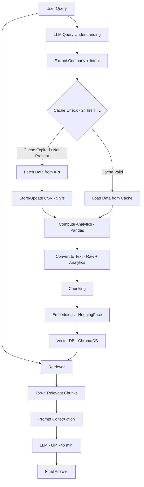

# 📊 Financial Intelligence System using RAG + Analytics

## 1. Introduction

This project implements a Retrieval-Augmented Generation (RAG) based financial analysis system that combines financial data retrieval, vector-based semantic search, and LLM-based reasoning.

Unlike traditional RAG systems, this project integrates an analytics layer and stores both raw financial data and computed metrics into a unified document store, making the system fully query-driven.

---

## 2. Objective

* Build a fully queryable RAG-based financial system
* Enable dynamic retrieval of both raw and computed financial insights
* Integrate LLM-based query understanding (entity + intent extraction)
* Ensure efficiency using caching and controlled data refresh

---

## 3. 🧩 Project Architecture

> This architecture ensures efficient data handling using caching while maintaining a fully query-driven retrieval system.

---

## 4. Key Design Flow

### Step 1: Query Understanding

* User query is passed to the LLM
* LLM extracts:

  * Company name
  * Query intent (analysis / descriptive / comparison)

---

### Step 2: Cache Mechanism (24-hour TTL)

* System checks:

  * Whether data exists in cache
  * Whether last update is within 24 hours

#### If cache is valid:

* Load data directly from cache
* Avoid API calls and recomputation

#### If cache expired:

* Fetch fresh data from API
* Update CSV storage
* Recompute analytics

> Cached data prevents repeated API calls and avoids unnecessary recomputation of analytics.

---

### Step 3: Data Preparation

* Fetch 5 years of historical stock data
* Compute financial metrics:

  * 1-year growth
  * 5-year growth
  * Volatility
  * Average return

---

### Step 4: Unified Document Creation

Both are combined into a single knowledge source:

* Raw financial data
* Computed analytics

Converted into:

👉 Text → Chunking → Embeddings

---

### Step 5: Vector Storage

* Stored in ChromaDB
* Enables semantic similarity-based retrieval

> Embeddings are regenerated only when new data is fetched, ensuring consistency between stored data and vector representations.

---

### Step 6: Retrieval (RAG)

* Query is converted into embedding
* Top-K relevant chunks retrieved
* Only relevant context is passed to the LLM

---

### Step 7: Response Generation

* LLM generates answer using retrieved context
* Fully retrieval-driven response generation
* No direct injection of analytics into prompt

---

## 5. Project Structure

* `rag_pipeline.py` – Main pipeline (query → retrieval → response)
* `data_storage.py` – Handles CSV storage and updates
* `analytics.py` – Computes financial metrics
* `embeddings.py` – Text chunking and embedding generation
* `vector_store.py` – Vector DB creation (ChromaDB)
* `data/` – Cached financial data (CSV)
* `vector_db/` – Persisted embeddings

---

## 6. Core Components

### Data Layer

* API-based financial data (via yfinance)
* Stored locally as CSV
* Updated only when cache expires

---

### Analytics Layer

* Uses Pandas for deterministic computation
* Converts structured metrics into text format
* Stored alongside raw data in vector DB

---

### Retrieval Layer (RAG)

* Uses semantic similarity search
* Retrieves only relevant chunks

---

### LLM Layer

* Model: GPT-4o mini
* Temperature = 0 (deterministic output)

Used for:

* Query understanding
* Final response generation

---

## 7. Design Decisions

### Why Full RAG (Including Analytics)?

* Makes entire system queryable
* Avoids unnecessary prompt injection
* Enables flexible querying of both raw and computed data

---

### Why Caching?

* Reduces API calls
* Improves latency
* Prevents repeated computation
* Ensures data freshness within a defined time window

---

### Why LLM for Query Understanding?

* Handles flexible and natural language queries
* Eliminates need for rigid rule-based mapping
* Supports multi-intent queries

---

## 8. Advantages

* Fully query-driven system
* Unified knowledge base (raw + analytics)
* Reduced prompt noise
* Efficient via caching
* Scalable and modular architecture

---

## 9. Limitations

* Re-embedding required when data updates
* Retrieval quality depends on chunking strategy
* No real-time streaming data
* LLM dependency for query parsing

---

## 10. Future Improvements

* Incremental embedding updates
* Multi-company query handling
* Visualization dashboard (Streamlit)
* Advanced query decomposition
* Hybrid structured + vector retrieval

---

## 11. Conclusion

This project demonstrates a fully queryable RAG-based financial system where both raw financial data and computed analytics are embedded and retrieved dynamically.

It highlights how combining retrieval, computation, and LLM reasoning leads to a scalable and efficient AI system for financial insights.

---
